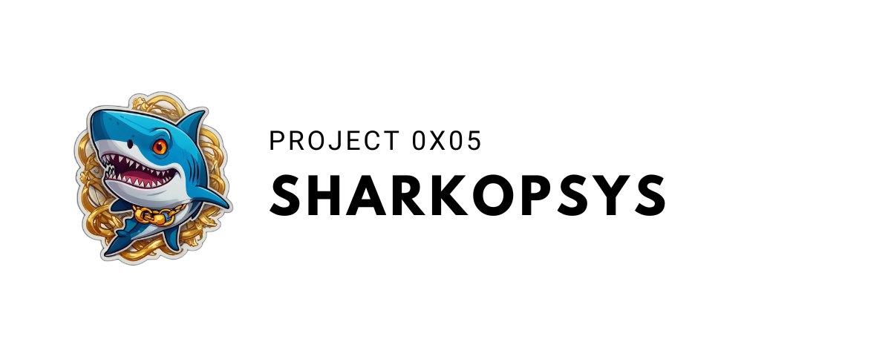

**Project description**

This project aims to easily deploy a working environment for developers and security testers, providing all necessary tools. It will include creating aliases to save time, all accompanied by comprehensive documentation

## Contents

1. [Installation](#installation)
2. [Usage](#use)
3. [Contribute](#contribute)
4. [License](#license)

## Installation

To install it, nothing could be simpler, you simply have to make the script executable and launch it as below:

```bash
git clone https://github.com/TheHackdes/0x05---SharkOpSys
cd 0x05---SharkOpSys
chmod +x install.sh
./install.sh
```

## Use

### Aliases

- All aliases are stored in `/etc/aliases` and sourced in `~/.zshrc`.

## Contribute

As a reminder, this project is still only a draft, as we are still learning about this provision, any contribution and opinion /improvement of this provision is welcome.

The same goes for adding functionality, don’t hesitate to:

1. Project fork
2. Create a new branch (`git checkout -b feature/new-feature`)
3. Commit your changes (`git commit -am 'Added a new feature'`)
4. Branch push (`git push origin feature/new-feature`)
5. Create a pull request

## License

This project is distributed under the MIT License, a permissive open source license that allows anyone to use, modify and distribute the code, as long as the copyright notice and license are included in all copies or substantial parts of the software. This license is renowned for its simplicity and flexibility, offering great freedom to users.
